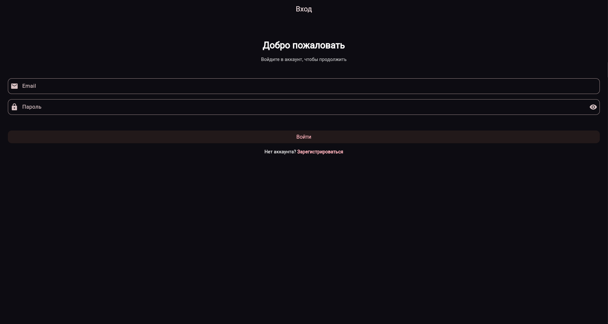
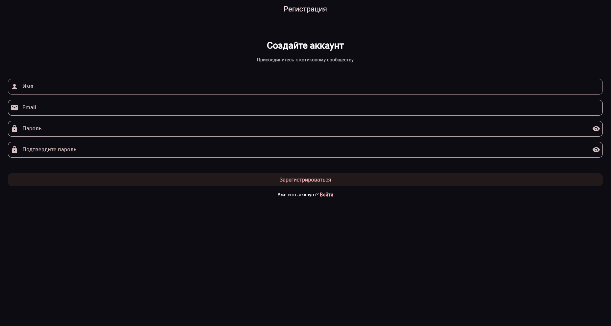
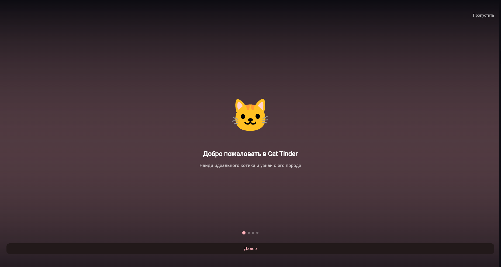

# Cat Tinder
https://github.com/ProgrammerPeasant/cat_tinder/actions/runs/22686535390/artifacts/5766981165 ссылка на апк)))
Приложение для любителей котиков, построенное с использованием современных подходов разработки на Flutter, Clean Architecture и CI/CD.

## Фичи и Улучшения

- **Онбординг (Onboarding):** Красивые экраны приветствия при первом входе, обучающие пользователя базовому функционалу.
- **Локальная Авторизация:** Встроенная система Login/Register. Пароли/логины и кэш обрабатываются через `flutter_secure_storage` и `SharedPreferences`
- **Чистая Архитектура (Clean Architecture):** Проект разделен на слои: Data, Domain, Presentation. Использован `Provider` для управления стейтом
- **Безопасность API:** Ключи к сервисам вынесены в `.env` (основной – `CAT_API_KEY`) и не светятся в репозитории через `.gitignore`
- **Аналитика:** Встроен сервис интерфейсной аналитики `AnalyticsService`. Реализовано локальное логирование событий, с возможностью включения `FirebaseAnalyticsService` для продакшена в один клик
- **CI/CD:** Настроен пайплайн GitHub Actions (`.github/workflows/flutter_test.yml`) для автоматического линтинга, прогона тестов и генерации релизного APK
- **Тестирование:** Более 20 юнит и виджет тестов (Слои Data/Network, Controllers, Authorization, Routing)


**Экран логина**


**Экран регистрации**


**Один из экранов анбординга**


**Демо-видео новых фич** (на гх нет хтмл поддержки, смотрите в файлах)
 

## Как запустить проект локально

1. Убедитесь, что у вас установлен актуальный Flutter SDK.
2. Склонируйте репозиторий:
   ```bash
   git clone https://github.com/ProgrammerPeasant/cat_tinder
   cd cat_tinder
   ```
3. Создайте файл `.env` в корне проекта и добавьте ваш API ключ к TheCatAPI:
   ```env
   CAT_API_KEY=your_cat_api_key_here
   ```
4. Установите зависимости и запустите:
   ```bash
   flutter pub get
   flutter run
   ```

## Тестирование

```bash
# Запуск тестов
flutter test
```

## Статус Firebase Analytics и Production APK

- **Аналитика:** В проекте уже заложена архитектура аналитики (интерфейс `AnalyticsService`). На данный момент локально используется `LocalAnalyticsService`.
  Для использования Firebase Analytics для продакшена, вам нужно:
  1. Создать проект в [Firebase Console](https://console.firebase.google.com/).
  2. Добавить ваше Android/iOS приложение в проект Firebase.
  3. Скачать файлы конфигурации `google-services.json` (Android) и/или `GoogleService-Info.plist` (iOS) в ваш проект.
  4. В файле `lib/main.dart` раскомментировать `await Firebase.initializeApp(...)` и заменить инстанс аналитики:
     ```dart
     final analytics = FirebaseAnalyticsService(); // вместо LocalAnalyticsService
     ```

- **Сборка APK:** В репозитории уже автоматизирована сборка `apk --release` при пуше. Сборка релизного APK на локальной машине через команду `flutter build apk --release` потребует настройки Android SDK (например, указания системной переменной `ANDROID_HOME`). Сейчас на вашей рабочей машине эта переменная отсутствует, поэтому самым удобным вариантом будет использование уже готовых сборок (`.apk`), которые автоматически выкладываются Actions-ботом в "Артефакты" на странице GitHub-репозитория после успешного тестирования кода!


## APK

- [Cat Tinder v1.0.0 (release)](artifacts/cat_tinder-v1.0.0.apk)


- `lib/app.dart` – точка входа UI и таб-бар
- `lib/features/swipe/` – свайпы, детали анкеты, очередь котов
- `lib/features/breeds/` – список пород и детали
- `docs/architecture.md` – схема приложения

